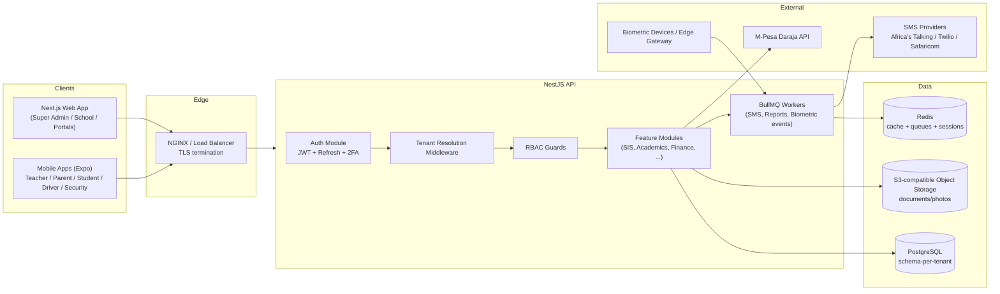

# System Architecture

## 1. High-level component diagram



## 2. Multi-tenant strategy: schema-per-tenant

**Why not database-per-tenant?** True isolation, but at 100+ schools it multiplies connections,
migrations, and ops overhead (each DB needs its own connection pool, backup job, monitoring).

**Why not a shared table with `tenant_id` column?** Cheapest to build, but one missing `WHERE
tenant_id = ?` clause anywhere in the codebase leaks another school's data. Given the explicit "no
school should ever access another school's data" requirement, this risk is unacceptable for this
domain (student PII, medical data, exam records).

**Chosen: schema-per-tenant in a single PostgreSQL cluster.**
- Each tenant gets its own Postgres schema (`tenant_<slug>`), created by running the same Prisma
  migration set against it at tenant-creation time.
- A request-scoped `TenantContextService` resolves the tenant (from JWT claim, set at login) and the
  Prisma client sets `search_path` to that tenant's schema for the duration of the request — so
  every query in feature-module code is automatically tenant-scoped without each query needing to
  remember a `tenant_id` filter. There is structurally no way for a query to reach another schema
  unless it explicitly qualifies a table name with another schema (never done in application code).
- Platform-level data (tenants list, subscription plans, Super Admin users) lives in `public`, which
  ordinary tenant-scoped requests never touch.
- Trade-off accepted: single Postgres instance is a shared blast radius for infra-level incidents
  (not app-level data leakage) — mitigated by standard Postgres HA/backup practice, out of scope for
  app code.

## 3. Request flow (tenant-scoped request)

```mermaid
sequenceDiagram
    participant C as Client
    participant MW as Tenant Middleware
    participant G as JWT/RBAC Guard
    participant P as PrismaService (search_path=tenant_x)
    participant DB as Postgres

    C->>MW: HTTP request + Bearer JWT
    MW->>MW: decode JWT -> tenantSchema claim
    MW->>P: bind request-scoped client to tenant schema
    MW->>G: next()
    G->>G: check role/permission for route
    alt authorized
        G->>P: query
        P->>DB: SET search_path TO tenant_x; SELECT ...
        DB-->>P: rows (tenant_x only)
        P-->>C: response
    else unauthorized
        G-->>C: 403 Forbidden
    end
```

## 4. Auth model

- Passwords hashed with bcrypt (cost 12).
- Login issues a short-lived access JWT (15 min default) and a longer-lived refresh token (7 days,
  stored hashed, rotated on use).
- JWT claims: `sub` (user id), `tenantSchema` (or `null`/`"public"` for platform users), `roles`.
- 2FA: TOTP secret field + `twoFactorEnabled` flag scaffolded on `User`/`PlatformUser`; enforcement
  wired when the first admin-facing settings UI ships (Phase 2).
- RBAC: `@RequirePermission('MODULE:ACTION')` decorator + a guard that checks the JWT's resolved
  roles against the tenant's `RolePermission` rows — server-side on every request, never trusted from
  the client.

## 5. Tech stack (and why)

| Layer | Choice | Why |
|---|---|---|
| Frontend | Next.js 14 (App Router) + TS + Tailwind + shadcn/ui | SSR for fast first load on modest school-network bandwidth, component quality bar matching Linear/Stripe-style UI ask |
| Data fetching | React Query | Caching, background refetch, optimistic updates for dashboards |
| Forms | React Hook Form + Zod | Type-safe validation shared with backend DTOs via `packages/shared` |
| Backend | NestJS | Opinionated module/DI structure scales better than plain Express for a 20+ module ERP; first-class Swagger, guards, interceptors |
| ORM | Prisma | Type-safe, first-class multi-schema migration support, good DX for a large evolving schema |
| DB | PostgreSQL 16 | JSONB for flexible CBC rubric/competency data, strong relational integrity for finance |
| Cache/Queue | Redis + BullMQ | SMS/report/biometric-event processing off the request path |
| Object storage | S3-compatible (MinIO locally, AWS S3/DO Spaces in prod) | Documents, photos, biometric refs |
| Auth | JWT + refresh, bcrypt, TOTP | Stateless horizontal scaling, standard 2FA |
| Infra | Docker Compose (dev) → Kubernetes (prod, Phase 10) | Reproducible local dev now, documented scale-out path |

## 6. Phase roadmap (source of truth: `C:\Users\Administrator\.claude\plans\dynamic-coalescing-deer.md`)

1. **Phase 0/1 (done)** — Docs + monorepo foundation: auth, tenants, RBAC skeleton, Super Admin
   school creation, minimal web shell.
2. **Phase 2 (done)** — Admissions (application → interview/offer/reject/waitlist → admit), Attendance
   (mark/lock/reopen with class-teacher-of-record enforcement), Homework (assign/submit), guardian
   linking, and real Class Teacher/Parent/School Administrator UI (tabs gated by permission).
3. **Phase 3 (done)** — Subjects + teacher subject-assignments, Exams/ExamSubjects with a
   DRAFT→SUBMITTED→APPROVED workflow (submit by the assigned teacher, approve/reject by
   EXAM:APPROVE, reopen by EXAM:REOPEN), numeric or CBC-rubric (EE/ME/AE/BE) scoring per
   exam-subject, and per-student report cards that only ever surface APPROVED marks.
4. **Phase 4 (done)** — Finance: fee structures → bulk invoice generation, payments with receipt
   numbering and denormalized balance tracking, M-Pesa STK push as a documented stub. Communications:
   provider-agnostic SmsProvider (stub implementation), manual announcements (class → guardians),
   automatic payment-receipt SMS.
5. **Phase 5 (done)** — Transport (vehicles/routes/student assignment), Library (catalogue/loans/
   fines), Inventory (items/stock movements, staff-only), Health (medical alerts/clinic visits),
   Discipline (cases with automatic guardian SMS), HR (leave request/approval self-service). Kitchen
   and full payroll/GL remain planned — see docs/SRS.md §4.19–4.22.
6. **Phase 6 (done)** — UX depth and cross-module polish rather than a new module: a permission-gated
   sidebar app shell replacing the old top-nav across all `/school/*` pages; a tenant-scoped Settings
   module so a School Administrator can self-serve branding (logo, mission/vision/motto, colors,
   address/SMS sender ID), with payment/banking config (M-Pesa paybill, bank details) kept
   Super-Admin-only per tenant; a local-disk file-upload stub (`UploadsModule`, swappable for S3 later,
   mirroring the `SmsProvider` abstraction pattern) used for student photos and the school logo;
   server-rendered branded PDF report cards (`pdfkit`) that pull the school's logo/mission/vision and
   the student's photo into a downloadable document; and a full Trips workflow on top of Transport —
   a Class Teacher proposes a trip, a School Administrator approves/rejects it (broadcasting an SMS to
   every guardian on approval), and a Parent registers a child and pays the exact per-student cost
   through a trip-scoped ledger separate from the Finance `Invoice`/`Payment` tables, with its own
   `TRP-YYYY-NNNN` receipt series and a payment-confirmation SMS.
7. **Phase 7 (done)** — Analytics dashboards and remaining cross-module UX depth. A role-scoped
   `GET /dashboard` endpoint (`DashboardModule`) computes stat/chart sections conditionally by
   permission, exactly mirroring the "server decides what's included" scoping pattern used by
   `StudentsService.list()` since Phase 1 — a School Administrator (who holds nearly every permission)
   sees a school-wide section (student/gender/grade counts, staff-by-role), a finance section
   (revenue/outstanding/collection rate), and a trips section; a Class Teacher sees only their own
   class's attendance stats; a Parent/Student sees only their own children's attendance/fee/trip data.
   The `/school` route became this dashboard (Students moved to `/school/students`); charts render via
   `recharts` (bar/pie/line). Every class now has an assignable class teacher of record via
   `PATCH /classes/:id` and a dedicated Classes management page — this is what actually activates a
   teacher's attendance-marking rights, since `AttendanceService` already enforced `classTeacherId`
   from Phase 2 but there was previously no UI to set it. Trips gained a live days-until-trip countdown
   badge (computed client-side from `tripDate`, shown to teachers/admins/parents alike). A UI polish
   pass added toast notifications (`sonner`) and "sweet alert"-style confirm dialogs in place of raw
   inline errors and native `confirm()` calls, shimmer skeleton loaders in place of "Loading..." text,
   animated stat cards, and a redesigned login page — built on the existing Tailwind/hand-rolled
   component system rather than adopting the MUI component library, since swapping component systems
   mid-project across 15+ existing pages would be a much larger, riskier rewrite for the same visual
   outcome.
8. **Phase 8 (done)** — SIS depth, biometric attendance (as an honest event-log stub — no real
   face/fingerprint hardware or ML matching runs in this codebase, see docs/SRS.md §4.9), and three
   modules the source requirements always listed but that hadn't landed yet. Student records gained
   `addressLine`/`landmark`/`latitude`/`longitude` plus a full edit form (previously only photo/
   UPI/NEMIS/class were patchable) and a Leaflet/OpenStreetMap pin-drop picker (no paid maps API key
   anywhere in this repo). `BiometricEvent` (subjectType STUDENT|STAFF, method FACE|FINGERPRINT,
   direction IN|OUT) is logged by staff through a form standing in for a real device webhook; a
   STUDENT OUT event fires a guardian SMS with a static ETA from the student's transport `Route.
   estimatedMinutes` (no live GPS); no DELETE route exists anywhere in the module — events are
   `archived`, never removed. Report cards gained a real downloadable filename
   (`Lastname_Firstname_ExamName_TermN_ReportCard.pdf`, previously always `report-card.pdf`) and
   admin-configurable pass-mark coloring (`Tenant.passMarkPercent`) applied identically in the PDF and
   the on-screen table. The Kitchen module is deliberately *not* a new parallel stock system — it
   reuses `InventoryItem`/`StockMovement` (the same running-quantity math from Phase 5) filtered to
   `category="Kitchen"`, exactly matching what docs/SRS.md always said the plan was for category-
   specific inventory views. Every staff member (teaching or not) gets a Payslips tab (HR-issued,
   downloadable PDF — not computed from an automatic payroll engine, that remains PLANNED) and a daily
   Work Log, both added to the existing HR page rather than a separate "non-teaching staff" module,
   since RBAC already treats "any non-Parent/Student role" as staff uniformly. The Super Admin
   dashboard gained a real per-school storage figure (`SUM(pg_total_relation_size(...))` across every
   table in the tenant's Postgres schema, plus the tenant's uploads-folder byte size — not an
   estimate). A `prisma/backup-database.ts` script wraps `pg_dump` (the whole database in one dump,
   since schema-per-tenant means every school lives in one Postgres database) plus a tar of the
   uploads folder into timestamped files under `backups/`; it does not upload anywhere, since this
   environment has no cloud storage credentials to wire it to.
9. **Phase 9 (done)** — Cross-cutting UI/UX depth and a real Super Admin platform-ops layer, plus one
   correctness bug fix. A `noneOf`/`disabled`-gating bug let a Parent see (but not actually submit —
   the backend guard was always sound) editable attendance dropdowns on `/school/attendance`; the
   status cell now renders a read-only `Badge` for anyone without `ATTENDANCE:MARK`. The `/school`
   and Super Admin layouts moved from a single page-level scroll to `h-screen overflow-hidden` with
   independently scrolling sidebar/main panes; the sidebar gained a collapse-to-icon-rail toggle
   (persisted in `localStorage`). A computed notification bell (`GET /notifications`) surfaces
   pending-approval/low-stock/overdue-invoice/upcoming-trip items per permission — same "server
   decides what's included" pattern as `DashboardService`, not a new persisted table. A reusable
   `useTableControls` hook (client-side sort/paginate) plus `<Pagination>`/`<SortableTh>` components
   were applied across the Super Admin schools list and several tenant list pages.
   The Super Admin got its own sidebar-shelled app (`SuperAdminSidebar`, mirroring the tenant
   `Sidebar`) instead of one flat page, plus a genuine platform billing system: `PlatformInvoice`/
   `PlatformPayment` models (whole-KES amounts, same convention as tenant-side Finance), a
   platform-level `EmailProvider` stub mirroring `SmsProvider` exactly (logs instead of sending — no
   email credentials in this environment), issuing an invoice emails the school's admin, recording a
   payment that reaches the invoice amount marks it PAID, extends `Tenant.currentPeriodEnd` by the
   billing period, and **automatically reactivates a SUSPENDED tenant** — the "restore after payment"
   behavior works for any recorded method (bank, M-Pesa, cash), it's just that M-Pesa/bank
   confirmation itself is still a manual Super-Admin action, not a live payment-gateway webhook (no
   real Daraja/bank API credentials exist in this environment, same caveat as the tenant-side M-Pesa
   stub from Phase 4). Downloadable invoice/receipt PDFs are available to both the Super Admin and,
   read-only, the School Administrator (`GET /settings/billing`) on their own Settings page. A
   password-reset action generates a fresh temporary password shown once — **real passwords are
   never displayed, to the Super Admin or anyone else**, since they're one-way bcrypt hashes; this is
   the only honest way to help a locked-out school. Cross-schema audit-log and real per-school storage
   (Postgres table sizes + uploads-folder bytes) round out the School detail page. A `backups/run`
   endpoint (background-triggers `backup-database.ts`) and a `backups/` list page complete the
   platform-ops picture — the earlier host-installed-`pg_dump` assumption was fixed to shell out via
   `docker compose exec` into the `postgres` service instead, since Postgres runs in Docker, not on
   the host, in this environment.
   Finally, the login page dropped its explicit "Super Admin / School" tab UI — one form (email,
   password, an optional collapsed "School slug" field) now covers both, exactly mirroring what
   `AuthService.login()` already did server-side (route by whether a `tenantSlug` was submitted).
10. **Phase 10** — Payment-gated account activation + real outbound email/SMS. Non-demo schools are
    now created locked (`TenantStatus.PENDING_PAYMENT` — login blocked, same style of check as
    `SUSPENDED`) with a Super-Admin-set one-time activation fee on a first `PlatformInvoice`. The
    welcome email carries a public `/activate/:token` link — no login needed, since the school can't
    log in yet; the token is a signed JWT (`{ tenantId, invoiceId, purpose: 'activation' }`, 30-day
    expiry) rather than a stored row, so nothing new needed persisting just to hand out a link. That
    page triggers a **real** Safaricom Daraja STK Push (`PlatformMpesaService` — OAuth token cached
    in-memory, sandbox/production switched by `MPESA_ENV`), and Safaricom's async callback
    (`POST /public/activation/mpesa-callback`) is the one place in this codebase that turns a webhook
    into a state change: it records a `PlatformPayment` (`recordedByUserId: null` — the schema now
    allows this, since an automated payment has no Super Admin behind it, shown in the UI as "via
    M-Pesa (self-service)"), marks the invoice PAID, flips the tenant `ACTIVE`, and sends a second
    email + SMS. The Super Admin can also manually activate a `PENDING_PAYMENT` school (paid another
    way) from the same control used for `SUSPENDED`, and can copy/resend the activation link from the
    school detail page (re-derived on demand from the same deterministic signing, not stored). This
    is the one payment flow in the app that's now a live webhook, not a manual confirm — the
    *recurring renewal* flow from Phase 9 is unchanged and still manual. Alongside this, `EmailProvider`
    and `SmsProvider` gained real implementations (Resend; Advanta SMS) selected by a
    `useFactory` provider that checks for an API key at boot and falls back to the original
    logging-only stub when absent, so every environment without credentials configured keeps working
    exactly as before.
11. **Phase 11** — Mobile apps, AI features, full biometric hardware/ML integration (the honest-stub
    version landed in Phase 8; this is the part that needs real devices), a live payment-gateway
    webhook for the *recurring renewal* billing flow specifically (Phase 10 only covered one-time
    activation), test suites, CI/CD, Kubernetes, manuals, security hardening pass.

## 7. Security posture at each phase

Phase 1 ships: hashed passwords, JWT + refresh rotation, server-side RBAC checks, tenant isolation by
construction, soft deletes, audit log for auth/tenant/user mutations. Rate limiting, full 2FA
enforcement, GDPR/Kenya DPA request handling, and a formal pen-test pass are tracked for Phase 10 and
should not be assumed present before then.
