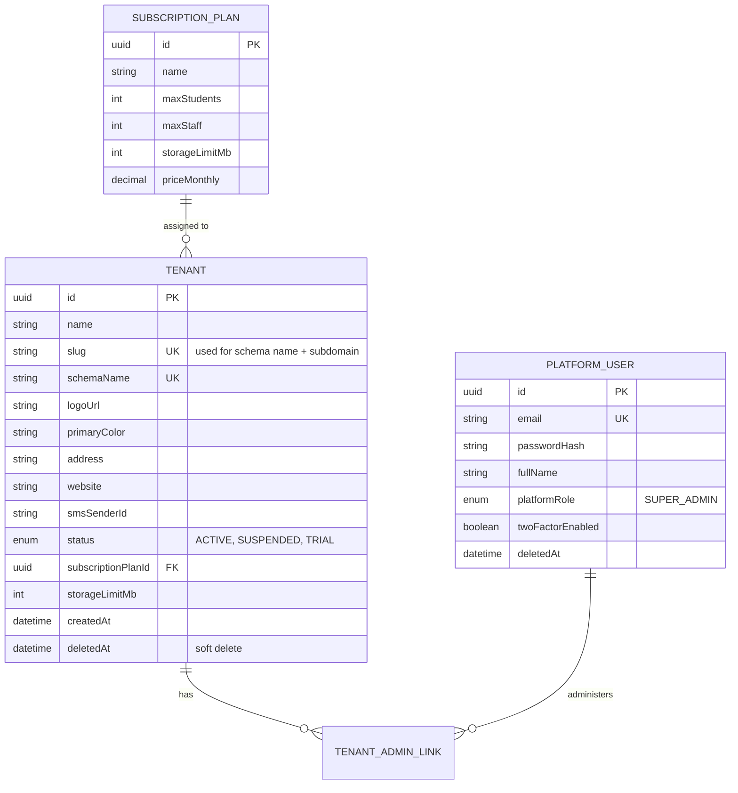
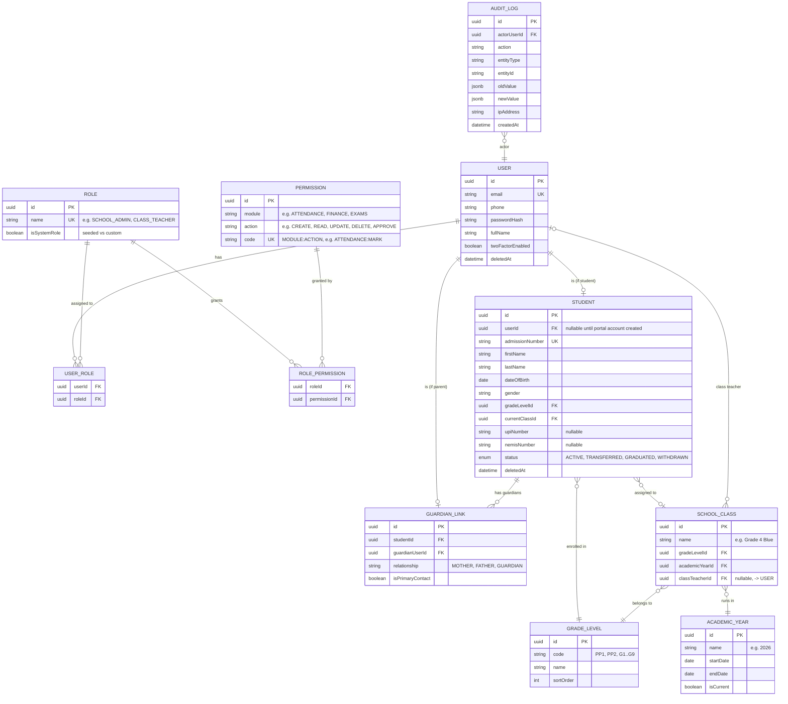

# Entity-Relationship Design

Two logical groups of tables, mirrored physically as **Postgres schemas**:

- **`public` schema** — platform-level, Super-Admin-owned: tenants, subscription plans, platform
  users/roles, audit log for platform actions.
- **`tenant_<slug>` schema** (one per school, created on tenant provisioning) — everything that
  belongs to a single school: users, roles/permissions, students, staff, academic structures,
  attendance, exams, finance, etc. Identical table structure across every tenant schema, applied via
  the same Prisma migration run against each schema in turn.

This document covers the entities implemented in Phase 1 in full detail, and the future-phase
entities at a lighter (name + purpose) level so the whole domain model is visible up front.

## Phase 1 entities (built)

### Within each tenant schema

## Phase 2 entities (built)

Added in the `phase2_attendance_homework_admissions` migration, same tenant schema, same
soft-delete/audit conventions:

- **AttendanceRecord** — `(studentId, classId, date)` unique, `status`, `markedByUserId`, `locked`
- **Assignment** — `classId`, `title`, `description`, `dueDate`, `createdByUserId`
- **Submission** — `(assignmentId, studentId)` unique, `submittedAt`, `content`, `grade`, `teacherComment`
- **Application** — admissions pipeline; `status` (Applied→Interview→Offered/Rejected/Waitlisted→Admitted),
  `admittedStudentId` (nullable FK to Student, set on admit)

## Phase 3 entities (built)

Added in the `phase3_examinations` migration:

- **Subject** — `name`, `code`
- **SubjectAssignment** — `(subjectId, classId, teacherId)` unique; who's authorized to enter marks for what
- **Exam** — `name`, `examType` (CAT/MIDTERM/ENDTERM/CBC_ASSESSMENT/PROJECT/PRACTICAL), `academicYearId`, `term`
- **ExamSubject** — `(examId, subjectId, classId)` unique; `maxScore`, `scoringMode` (NUMERIC/RUBRIC),
  `status` (DRAFT/SUBMITTED/APPROVED), `reviewComment`
- **Mark** — `(examSubjectId, studentId)` unique; `score` (numeric mode) or `rubricLevel` (EE/ME/AE/BE,
  CBC mode), `comment`, `enteredByUserId`

## Phase 4 entities (built)

Added in the `phase4_finance_communications` migration. Money amounts are whole KES (`Int`), not
`Decimal` — see model comments in schema.prisma:

- **FeeStructure** — `name`, `gradeLevelId`, `academicYearId`, `term`, `amount`
- **Invoice** — `studentId`, `feeStructureId` (nullable, for ad hoc invoices), `amount`, `balance`
  (denormalized, updated on every payment), `status` (PENDING/PARTIALLY_PAID/PAID/CANCELLED), `dueDate`
- **Payment** — `invoiceId`, `amount`, `method` (CASH/BANK/MPESA), `reference`, `receiptNumber`
  (unique, sequential `RCT-YYYY-NNNN`), `receivedByUserId`
- **MpesaStkRequest** — `invoiceId`, `phoneNumber`, `amount`, `checkoutRequestId` (unique),
  `status` (PENDING/SUCCESS/FAILED) — stub STK push; see model comment for the production
  callback-routing gap (a real Safaricom webhook needs tenant resolution from a public-schema lookup
  table, not built)
- **SmsMessage** — `recipientUserId` (nullable), `recipientPhone`, `body`, `status` (SENT/FAILED) —
  outbound log written by every `CommunicationsService` send regardless of provider outcome

## Phase 5 entities (built)

Added in the `phase5_library_transport_inventory_health_discipline_hr` migration:

- **Book** / **Loan** — `availableCopies` decremented on issue, incremented on return;
  `Loan.fineAmount` computed on return (flat KES/day-late — see LibraryService.FINE_PER_DAY)
- **Vehicle** (`driverId` → any User) / **Route** (`vehicleId` optional) / **TransportAssignment**
  (`studentId` unique — one active route per student)
- **InventoryItem** / **StockMovement** (`type` IN/OUT, `quantity` kept in sync on `InventoryItem`)
- **MedicalAlert** / **ClinicVisit** — both scoped like every other student-linked record
  (staff-wide vs. Parent's-own-child vs. Student's-own)
- **DisciplineCase** — `category` (WARNING/DETENTION/SUSPENSION/POSITIVE_BEHAVIOR); creating one
  triggers an automatic SMS to the student's primary guardian via `CommunicationsService`
- **LeaveRequest** — `requestedByUserId`/`reviewedByUserId` (any User, i.e. any staff member);
  `status` (PENDING/APPROVED/REJECTED)

## Future-phase entities (planned, not yet migrated)

| Domain | Key entities |
|---|---|
| Admissions | ApplicationDocument, InterviewSlot (scheduling beyond the status field) |
| Staff | StaffProfile, Qualification, Contract, PerformanceAppraisal (LeaveRequest is built — see Phase 5) |
| Biometric/Security | BiometricEvent, Device, VisitorLog |
| Timetable | TimetableSlot, LessonPlan, SchemeOfWork |
| CBC competency framework | LearningArea, Competency, PortfolioEvidence (see docs/SRS.md §4.15) |
| Discipline | BehaviorPoint (trend scoring beyond the case log itself) |
| Finance (GL/Payroll) | Expense, Budget, LedgerEntry, PayrollRun, Payslip, PurchaseOrder, Supplier |
| Transport | PickupPoint, TripLog, live GPS |
| Library | Reservation, barcodes/scanning |
| Kitchen | MealPlan, DailyMenu, StudentMealAttendance |
| Health | Vaccination |
| Communication (extra channels) | MessageTemplate, EmailLog, PushNotification |

Each will live in the same tenant schema, following the naming/soft-delete/audit conventions
established in Phase 1.

## Conventions

- All primary keys: UUID.
- All tables: `createdAt`, `updatedAt`, `deletedAt` (soft delete — `deletedAt IS NULL` = active).
- All mutating actions write to `AUDIT_LOG` via a Prisma middleware/interceptor, not ad hoc per
  endpoint.
- Cross-tenant foreign keys are impossible by construction — every tenant table lives in its own
  Postgres schema with no FK path to another tenant's schema.
